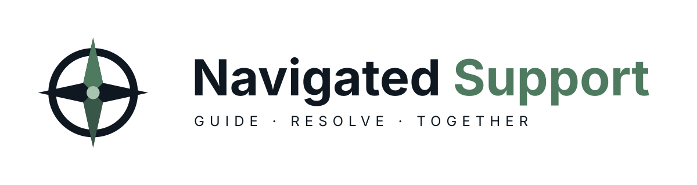

<picture>
  <source media="(prefers-color-scheme: dark)" srcset="apps/web/public/brand/horizontal-dark.svg" />
  
</picture>

# Navigated Support

**Open-source AI customer support, on your own server.** Connect an existing Zendesk operation or publish a branded help center, ticket portal, and embedded chatbot. Bring your own documents and model provider; decide what the agent can answer and which actions need a person’s approval.

[Get started](#self-host-with-docker) · [Try the store sandbox](#try-it-locally) · [Documentation](#documentation) · [Contribute](CONTRIBUTING.md) · [Apache-2.0 license](LICENSE)

> **Development release candidate.** Automated tests cover the application, but live connector and operational verification is still incomplete. The latest launch review also records a blocked real attachment-scanner check. Read the [launch audit](docs/launch-audit.md) and [release gates](docs/verification.md) before inviting real customers.

## What you can build

| Area             | Capabilities                                                                                                                                                                                  |
| ---------------- | --------------------------------------------------------------------------------------------------------------------------------------------------------------------------------------------- |
| Support channels | Tickets with email notifications and optional inbound replies, a bottom-right chat widget, or both. Each channel can use its own workflow. Owners can disable either channel.                 |
| Staff workspace  | A customer-grouped inbox with ticket/chat filters, unread and closed views, private notes, account history, assignments, approvals, and human takeover.                                       |
| Knowledge        | Upload PDF, DOCX, Markdown, or text; crawl public Docusaurus/GitBook documentation; select Notion pages or Google Drive files; import Zendesk articles. Review versions and answer citations. |
| FAQs and content | Write FAQs, ask AI to improve a draft, or let a bounded agent review approved documents. Publication and customer-answer approval are separate steps.                                         |
| Workflows        | Guided step builder and visual LangGraph editor, reusable components, custom replies, conditions, verified account lookups, allowed API actions, and isolated Python/JavaScript steps.        |
| Models           | OpenAI, Claude, Kimi, OpenRouter, DeepSeek, vLLM, and compatible providers. Separate response/embedding settings and workspace token budgets.                                                 |
| Business actions | Stripe refunds and subscription cancellation, Zendesk ticket operations, and fixed-destination custom APIs with schemas, approval limits, idempotency, and uncertain-outcome recovery.        |
| Improvement      | Multi-turn Test Lab comparisons, reviewed knowledge gaps, customer resolution and satisfaction feedback, analytics, and purpose-attributed usage.                                             |
| Operations       | Readiness diagnostics, private scanned attachments, business-hour SLAs, and reviewed shadow/canary workflow rollout. Optional controls start disabled.                                        |

Customer-facing replies use approved knowledge. Human takeover stops automatic replies and actions until staff resume the agent. A model, uploaded document, or chat-supplied email address cannot grant account access or execution authority.

## Try it locally

Use the isolated **Trail Supply** store sandbox to explore staff and customer accounts, example policies, tickets, refunds, subscriptions, and Test Lab cases. It uses simulated providers: no paid model calls, real payments, or customer outreach.

With **Node 24** and local **PostgreSQL 17 with pgvector** available:

```sh
git clone https://github.com/nahid-sparktales/fieldkit.git
cd fieldkit
npm ci
npm run sandbox
```

Open [the local store launch page](http://127.0.0.1:4321/). The [sandbox guide](examples/store/README.md) explains database configuration, generated local logins, and optional operational scenarios. Data persists between runs; resetting is explicit. The normal application starts empty and has no simulation switch.

## Self-host with Docker

You need one server with Docker Compose, a domain and TLS reverse proxy, SMTP, and access to response and embedding models. Model usage is billed by the provider you connect. Private attachment scanning is optional and requires additional memory; see [operations](docs/operations.md).

```sh
git clone https://github.com/nahid-sparktales/fieldkit.git
cd fieldkit
node scripts/setup.ts
# Without local Node 24:
# docker run --rm -v "$PWD:/app" -w /app node:24 node scripts/setup.ts
```

The setup command creates an ignored `.env` with unique secrets and refuses to overwrite an existing one. Set `FIELDKIT_URL` to your public HTTPS origin, and configure `SMTP_URL` and `SMTP_FROM`. Preserve the generated database password, authentication secret, and encryption key.

```sh
docker compose up --build -d
docker compose logs --tail=50 migrate app worker
```

Proxy your domain to `127.0.0.1:4317` with event streaming enabled. PostgreSQL stays on the private Compose network; the app and worker share a persistent upload volume. Migrations run before startup. Follow the [TLS, backup, upgrade, and recovery guide](docs/operations.md).

1. Register, verify your email, and create the first workspace using `FIELDKIT_SETUP_TOKEN` from `.env`.
2. Connect model credentials in **Connections** and choose response and embedding models in **Settings**.
3. Add knowledge and explicitly approve the sources the agent may use with customers.
4. Configure actions and workflows, then test them. Replies initially require staff review; account-changing actions have separate approval rules.
5. Customize **Publish → Appearance**, choose tickets/chat/both, and publish a channel or connect Zendesk. Invite staff in **Team**; manage customers separately in **Customers**.

## Security and data boundaries

- Application records, uploads, and encrypted provider credentials live on your server. Relevant model inputs and enabled integration requests go to the services you connect.
- Staff and customer identities are separate. Customer history, downloads, and feedback are scoped to their own conversations and workspace.
- Imported material starts staff-only. Approval for customer answers does not automatically publish an article.
- Business writes require validated identity, current policy, and exact approval or explicit automatic limits. Uncertain outcomes are reconciled before retrying.
- Attachments stay private and quarantined until scanning succeeds. Keep the scanner and optional code-runner broker off the public network; the runner broker has privileged Docker access.

See the [security policy](SECURITY.md) to report a vulnerability privately. The [launch audit](docs/launch-audit.md) records fixes, measured improvements, and remaining checks; it is not an independent security certification.

## Development and verification

Use the Node version in `.nvmrc`. Configure PostgreSQL/pgvector and SMTP, run `npm run setup` and `npm run migrate`, then start `npm run dev` and `npm run worker` in separate terminals. See [CONTRIBUTING.md](CONTRIBUTING.md).

For tests, set `TEST_DATABASE_URL` to a **disposable database ending in `_test`**. Backend and browser suites delete its contents and must run sequentially.

```sh
npm ci
npm run typecheck
npm run build
npm test
npx playwright install chromium
npm run test:browser
npm ci --prefix examples/demo
npm run test:demo
```

The production build generates Brotli/gzip assets; optional screens load on demand. CI checks dependencies, types, application/browser regressions, the archived demo, containers, the isolated runner, and the private scanner. A failed or blocked check remains a release gate. `npm run test:live` is a separate, opt-in model evaluation that consumes tokens; fixture-backed results do not establish live model quality.

## Documentation

| Guide                                                                             | Covers                                                                   |
| --------------------------------------------------------------------------------- | ------------------------------------------------------------------------ |
| [Operations](docs/operations.md)                                                  | Installation, TLS, upgrades, backups, retention, and credential rotation |
| [Customer support](docs/customer-support.md)                                      | Portal, widget, ticket email, inbound replies, and feedback              |
| [Branding and settings](docs/branding.md)                                         | Help-center customization, profile settings, and the new logo assets     |
| [Workflows](docs/workflows.md) / [custom components](docs/workflow-components.md) | Guided/visual editing, custom replies, code steps, and runner setup      |
| [Models](docs/models.md) / [integrations](docs/integrations.md)                   | Provider setup, OAuth registrations, identities, and business actions    |
| [Quality](docs/quality.md)                                                        | Test Lab, gaps, feedback, and analytics                                  |
| [Operational controls](docs/operational-controls.md)                              | Readiness, attachments, SLAs, shadow testing, and canary rollout         |
| [Architecture](docs/architecture.md) / [API](docs/api.md)                         | Authorization, `/v2` endpoints, event streams, SDK, CLI, and MCP         |
| [Launch audit](docs/launch-audit.md) / [verification](docs/verification.md)       | Observed results and remaining release blockers                          |

## Project identity and scope

Navigated Support was previously **FieldKit**. The repository URL, `FIELDKIT_*` environment variables, `fieldkit` CLI, `FieldKitClient` SDK, and `window.FieldKit` widget API keep their existing names for compatibility. The supplied Navigated Support logo is bundled locally in light/dark variants; customer portals retain their own branding. [Brand assets and guide](docs/branding.md#navigated-support-product-identity).

Version 2 is a breaking replacement of the original demo. The archived `demo-v1` tag and `examples/demo` remain available; install that example’s separate dependencies before `npm run demo`. Its SQLite dependencies are excluded from the production install.

The initial deployment boundary is one self-hosted installation on one server. Paid hosting, included model credits, OCR, unrestricted host scripts, and unrestricted agent HTTP access are outside this release.
