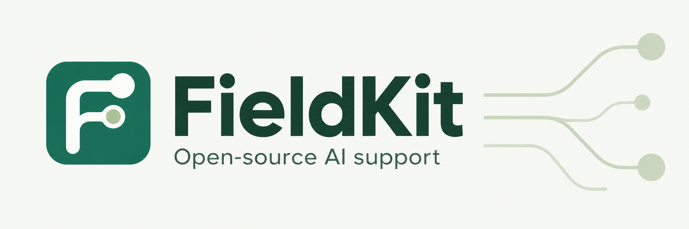

# FieldKit



An open-source, self-hosted AI support platform. Add an agent to your Zendesk operation, or publish your own help center, embedded chat, and customer portal with a staff inbox. Both use the same knowledge, visual LangGraph workflow, verified customer identities, and governed business actions.

Bring your own model provider and documents: OpenAI, Claude, Kimi, OpenRouter, DeepSeek, vLLM, or another OpenAI-compatible service. FieldKit retrieves evidence and proposes actions; application code controls identity, approval, and execution. Your application data, uploads, and encrypted credentials live on your server; model inputs and enabled provider requests are sent to the services you connect.

**Status: development release candidate.** The application and automated tests are implemented; several real vendor test-account verification gates remain open. See [verification and release boundaries](docs/verification.md) before using it for customer-facing operations.

Licensed under [Apache-2.0](LICENSE). **Version 2 is a breaking replacement of the original demonstration.** Fresh installations contain no fictional businesses, customers, connections, or credentials. The original is preserved at the `demo-v1` tag and in `examples/demo`. To run it explicitly, install its separate dependencies with `npm ci --prefix examples/demo`, then run `npm run demo`. Its SQLite dependencies are excluded from the production installation.

## What is implemented

- Verified email/password accounts, recovery, staff invitations, workspace roles, isolated customer history, and server-signed widget identities.
- Guided setup, model connection, document review, answer preview, publishing, customer accounts, articles, ticket conversations, private notes, assignment, approvals, and human takeover.
- **Knowledge → FAQs:** write and edit FAQ drafts, improve an answer with AI, or generate up to eight drafts from customer-approved knowledge. Approve each answer for retrieval and optionally publish it in the help center. Editing withdraws the previous answer until it is approved again; manual drafting requires no model key.
- **FAQ agent:** review every passage of every ready, customer-approved document, including all indexed documentation pages. Durable background batches show progress, support cancellation/retry, and save private FAQ drafts. Source changes invalidate unfinished work; existing FAQs are excluded and repeated questions are skipped.
- **Inbox support assistant:** triage and prioritize a ticket, research across indexed sources, draft a customer response, package an engineering escalation, and turn a resolved ticket into a private knowledge-base article. Review and edit outputs with evidence before applying them. Internal research can use staff-only knowledge; customer replies cannot. Type `/customer-support` in a staff reply box to open the assistant.
- PDF, DOCX, Markdown, text, individual website pages or entire public documentation sites (Docusaurus/GitBook), selected Notion pages, Google Picker files, and Zendesk help-center articles. Background ingestion, extraction errors, per-page versions and citations, manual refresh, and hourly synchronization. Imported knowledge starts staff-only; approval for customer answers and public article publication are separate controls.
- Multiple model providers inside LangGraph, separate response and embedding settings, PostgreSQL checkpoints, tenant-scoped pgvector/keyword retrieval, citations, provider-reported token usage, and workspace budgets. Claude uses its native Messages API; OpenAI uses Responses; other providers use compatible Chat Completions. Every result is schema-validated. See [model setup](docs/models.md).
- **Test Lab:** repeatable multi-turn suites, fixture-based account/API reads, workflow/model comparisons, immutable run snapshots, separate rules/AI/staff assessments, token caps, and durable cancellation/retry.
- **Knowledge → Gaps:** grouped unanswered questions, feedback and staff flags; bounded AI analysis, owner opt-in nightly analysis, private FAQ suggestions, and regression-test imports.
- **Analytics:** native resolution and satisfaction feedback, delivered response times, handoffs/reopens, channel/date filters, conversation drill-down, and purpose-attributed tokens/reservations. Zendesk CSAT imports are read-only and still require real-account release verification. [Quality guide](docs/quality.md).
- **Workflow:** visually edit the agent's actual LangGraph with draggable steps, outcome connections, customer-account lookup, selected knowledge/FAQs, model instructions, conditions, existing actions, approvals, exact replies, variable templates, and staff handoff. Reuse versioned subflows and Python/JavaScript/API steps with mapped inputs, outputs, and run logs. Save drafts, test routes without executing actions, publish immutable versions, and restore an earlier version as a new draft. See the [workflow guide](docs/workflows.md).
- Zendesk OAuth, signed webhooks, paginated synchronization, public replies, notes, tags, assignment, status, safe updates, and uncertain-outcome reconciliation.
- Separate Stripe test/live connections, purchase/subscription retrieval, full or partial refunds, and selected-subscription cancellation at period end. Fixed-destination custom APIs with schemas, reviewed customer mappings, exact approvals, automatic limits, durable operation IDs, and outcome lookup.
- A `/v2` API, event streams, authenticated SDK/CLI/MCP, durable PostgreSQL jobs, a separate worker, health checks, and Docker Compose packaging.

## Installation

Use a server with Docker Compose, a TLS reverse proxy, a domain, SMTP, and access to response and embedding models. A single OpenAI key covers the defaults; other providers and self-hosted models are supported. Node 24 is needed only for the local setup command; alternatively use the Node container below.

```sh
git clone https://github.com/nahid-sparktales/fieldkit.git
cd fieldkit
node scripts/setup.ts
# Alternatively: docker run --rm -v "$PWD:/app" -w /app node:24 node scripts/setup.ts
```

Edit the generated, ignored `.env`: set `FIELDKIT_URL` to your public HTTPS origin, `SMTP_URL`, and `SMTP_FROM`. Preserve the generated secrets and database password. Then:

```sh
docker compose up --build -d
docker compose logs --tail=50 migrate app worker
```

Proxy the public domain to `127.0.0.1:4317` with streaming enabled. PostgreSQL is private to the Compose network. App and worker share the persistent uploads volume. Migrations finish before either starts. See [operations](docs/operations.md) for TLS, backup, restoration, upgrades, and key rotation.

Open the app, register, verify your email, and create the first workspace with `FIELDKIT_SETUP_TOKEN` from `.env`. Invite staff from Team. Connect your model providers in **Connections**, select response and embedding models in **Settings**, add knowledge, approve customer-safe sources, configure actions, and test the agent. Use **Workflow** to customize and publish its graph, then publish a portal/widget or connect Zendesk. Replies initially require staff review; automatic replies are an explicit workspace setting. Account-changing actions initially require approval independently of reply mode.

In **Workflow**, select a step to choose its knowledge, account data, model instructions, or allowed actions. Drag steps and connect their outcomes, save a draft, test its route, and publish a version when ready. Only routes reaching model/embedding steps use model quota. Previews can read a selected verified customer's account and run isolated code, but never perform account writes or send replies. [Full workflow guide →](docs/workflows.md)

## Verification status

This is an implemented release candidate, **not a claim that the external release gates have passed**. Local database, safety, recovery, and browser tests use dedicated test databases and injected provider/model doubles. They do not establish real model quality or vendor compatibility. Live SMTP, model, Zendesk, Notion, Google, Stripe, and custom API test-account runs remain release blockers until their evidence is recorded. See [release gates](docs/verification.md).

```sh
npm ci
npm run typecheck
npm run build
# TEST_DATABASE_URL must point to a disposable database ending in _test.
npm test
npx playwright install chromium
npm run test:browser
npm ci --prefix examples/demo
npm run test:demo
```

Tests delete the contents of the dedicated test database. Never point them at installation data. Model doubles live only under `tests/`; the running app has no simulation switch. A separate opt-in live evaluation set is available with `npm run test:live` and reports missing credentials as blocked.

For local development, configure PostgreSQL 17 with pgvector, run `npm run migrate`, then run `npm run dev` and `npm run worker` in separate terminals. Real signup still needs SMTP.

## Guides

- [Test Lab, knowledge gaps, feedback, and analytics](docs/quality.md)
- [Visual LangGraph workflow editor](docs/workflows.md)
- [Custom replies, Python/JavaScript/API steps, subflows, and runner setup](docs/workflow-components.md)
- [Model providers and self-hosted vLLM](docs/models.md)
- [Integrations, identities, and custom actions](docs/integrations.md)
- [Installation and operations](docs/operations.md)
- [Architecture and authorization](docs/architecture.md)
- [API, SDK, CLI, and MCP](docs/api.md)
- [Verification and external release blockers](docs/verification.md)
- [Contributing and local development](CONTRIBUTING.md)
- [Reporting a security vulnerability](SECURITY.md)

One installation on one server and one agent configuration per workspace are the initial deployment boundaries. Paid hosting, subscriptions, included model credits, OCR, unrestricted host scripts, and unrestricted agent HTTP access are outside this release.
