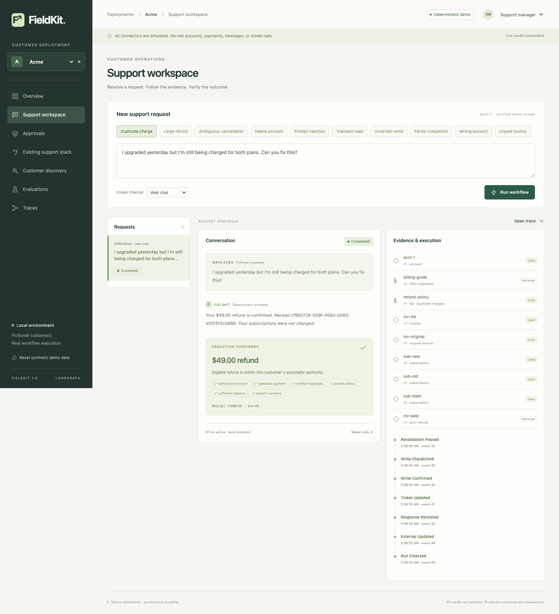
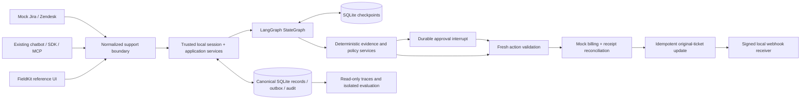

# FieldKit

**A local customer-deployment toolkit for governed operational AI workflows.** Keep the existing support system. Add evidence, policy, durable approval, verified execution, evaluation, and a trace you can inspect.

The reference deployment resolves fictional billing requests through a **real TypeScript LangGraph StateGraph** with **file-backed SQLite checkpoints**. A $49 duplicate charge changes the mock billing ledger and original support ticket. An $8,000 request pauses without moving money, survives a backend restart, and resumes the same operation after an authorized recorded decision.

All customers, contacts, articles, accounts, and transactions are fictional. Jira, Zendesk, Salesforce, Stripe, Confluence, and enterprise systems here are **simulated schema-compatibility fixtures**, not authenticated vendor integrations. No paid model, network connector, or real payment is used.



## Run locally

Use **Node.js 24 LTS** (supported engine: Node >=22.12; local verification used Node 25.5.0) and npm. Native SQLite dependencies may need the normal platform build tools if a prebuilt binary is unavailable.

Run these commands from `examples/demo`; its dependencies and lockfile are separate from the production app.

```sh
npm ci
npm run dev
```

Open **[http://localhost:4317](http://localhost:4317)** and click **Start demo**. The server binds only to loopback. First startup seeds the four deployments and creates `.fieldkit/`; subsequent starts preserve state. Dependencies are pinned in `package-lock.json`. Once installed, the application runs without runtime internet access or credentials.

Production-style local serving:

```sh
npm run build
npm start
```

`FIELDKIT_PORT` and `FIELDKIT_DATA` customize the local port and synthetic data directory. No `.env` file is required. `npm start` uses `tsx`, so retain development dependencies when installing this demonstration.

## What works

- Seven operational areas: overview, support workspace, approvals, existing support stack, discovery, evaluations, and traces. Responsive layouts, keyboard controls, labeled demo identities, real loading/error states, and deep-linked records.
- Four support adapters: mock Jira Service Management, mock Zendesk, generic existing chatbot, and the native workspace. Provider-native fields and IDs survive normalized processing and support writes.
- Acme ($100 automatic authority), Northstar ($25), Globex (every monetary action approved), and deliberately unprepared MessyCorp. Customer/account/invoice and knowledge schemas really differ.
- Captured-payment, duplicate relationship, ownership, currency, available-balance, evidence-version and current-policy gates. Account deletion always needs approval; ambiguous cancellation escalates.
- Durable decisions and execution requests; fresh-process recovery; resource reservations; operation reconciliation; explicit unknown and partial outcomes; idempotent support updates.
- Discovery reads five actual customer files and edits audited working copies. A mapping correction removes an actual finding. Reviewed policy, connector, label and support-capability remediation supports a measured red-to-green journey.
- Nine smoke cases; 64 independently authored base families; 640 seeded full-suite variations; separate recovery/integration regressions. JSON/Markdown reports, denominators, compatible comparisons, inspectable failures, sandbox reruns and fresh sandbox approvals.
- A typed REST client, authenticated stdio MCP server, and HMAC-signed outbound events delivered to a **local simulated receiver** with stable event IDs and distinct retry-attempt IDs.

Live model mode and real-provider integrations are unavailable. The deterministic proposal adapter runs inside the real graph. Its results do **not** measure LLM quality.

## Architecture



LangGraph persists the next workflow step and approval interruption. FieldKit owns authorization, proposals, decisions, resource reservations, receipts, evaluation and readiness. Checkpoints are neither billing records nor permission tokens. There is one support graph, no multi-agent supervisor, no hosted control plane, and no dependency on other personal projects.

| Directory | Responsibility |
|---|---|
| `apps/web` | React / TypeScript reference UI |
| `apps/api`, `apps/cli` | Local HTTP application and API-backed CLI |
| `packages/core` | Framework-independent domain contracts, canonical store, policy/services, discovery |
| `packages/workflows` | LangGraph definition, SQLite checkpointing, durable execution requests and recovery |
| `packages/connectors` | Customer-specific raw-record and knowledge normalization |
| `packages/integrations` | SupportAdapter contract, mock provider writes, normalized chatbot boundary, signed events |
| `packages/sdk`, `packages/mcp` | Thin typed API client and constrained MCP tools |
| `packages/evals` | Independently labeled cases, generator, isolated harness, reports, readiness and reruns |
| `customers` | Immutable baseline configuration, fixtures and labels |
| `tests` | Domain, API/SDK/MCP, real-graph, child-process recovery and browser checks |

## Verification

```sh
npm run check:compat      # Disk checkpoint, interrupt, exit, fresh-process resume
npm run typecheck
npm run build
npm test                 # Real graph + API + SDK + MCP + recovery/integration tests
npm run test:recovery
npx playwright install chromium   # One-time browser installation
npm run test:browser      # Starts its own isolated local server
```

With the main local server running:

```sh
npm run fieldkit -- eval acme --suite smoke
npm run fieldkit -- eval acme --suite full --seed 42
npm run fieldkit -- eval acme --suite recovery
npm run fieldkit -- onboard ./customers/messycorp
npm run fieldkit -- workflow inspect RUN_ID
npm run fieldkit -- replay TRACE_ID
npm run fieldkit -- replay TRACE_ID --rerun --sandbox
npm run fieldkit -- demo reset --customer acme
```

`init acme` refuses to overwrite the deployment that startup already seeded. CLI defaults to an explicitly simulated manager identity; `FIELDKIT_TOKEN` supplies an existing session instead. Use `FIELDKIT_CUSTOMER=northstar` for inspecting that customer's IDs. The CLI never accepts a thread override or arbitrary execution node. Read-only `replay` does not invoke LangGraph.

Reports intentionally retain real simulator failures. The reference seed-42 full run observed **620/640 case successes**, **410/410 critical-case passes**, and **640/640 side-effect safety checks**. Two held-out wording families (`reverse the second payment`, `credit the extra payment`) each contribute ten failures: the simulator safely escalates instead of recognizing their intent. These are synthetic observations, not production claims. See the dated [verification record](docs/verification.md) for commands, counts, report IDs and limitations.

## Guides

- [Three-minute demo and real restart walkthrough](docs/demo-walkthrough.md)
- [Architecture and change points](docs/architecture.md)
- [LangGraph design and verified dependency APIs](docs/langgraph-design.md)
- [Recovery, crash windows and replay semantics](docs/recovery-and-replay.md)
- [Existing support stack, REST, SDK, MCP and webhook contracts](docs/integrations.md)
- [Evaluation methodology and readiness gates](docs/evaluation-methodology.md)
- [Fictional customer case study](docs/customer-case-study.md)
- [Local deployment guide](docs/deployment-guide.md)
- [Threat model and limitations](docs/safety-and-limitations.md)

## Boundaries

This is a single-machine, single-runner demonstration. Demo actor selection is intentionally available locally; it is not enterprise IAM. Canonical and upstream mock records share a SQLite engine but commit in separate transactions; tested behavior is not a guarantee for a real remote provider. Outbound delivery targets only the local simulated receiver. No public deployment, real vendor authentication, genuine financial operation, live model, calibrated confidence, production latency, savings, or real-customer outcomes are claimed.

Runtime databases, checkpoints, sessions, webhook keys and generated evaluations stay under ignored `.fieldkit/`. The scoped reset affects the selected tenant's synthetic records and checkpoint threads; see retention details in the safety guide. Baseline customer files are never silently overwritten.
